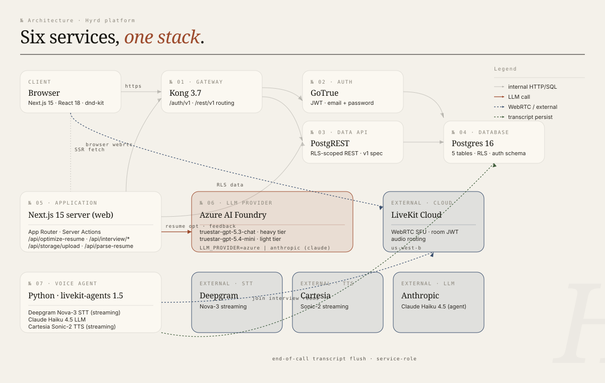
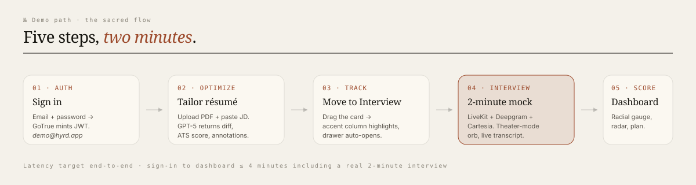

<h1 align="center">Hyrd</h1>
<h3 align="center">A Premium Career Platform</h3>

<p align="center">
  <em>One quiet workspace for the entire job search — résumé, tracker, AI mock interview, performance.</em>
</p>

<p align="center">
  
  
  
  
  
  
  
</p>

<p align="center">
  <strong>CMPE 280 — Web UI Design and Development | Spring 2026 | San Jose State University</strong>
</p>

---

## Table of Contents

- [Team Members](#team-members)
- [Problem Statement](#problem-statement)
- [Demo Walkthrough](#demo-walkthrough-for-presentation)
- [Technical Summary](#technical-summary)
- [Individual Contributions](#individual-contributions)
- [What We Built](#what-we-built)
- [Tech Stack](#tech-stack)
- [Design System and Patterns](#design-system-and-patterns)
- [Animation System](#animation-system-framer-motion)
- [Component Architecture](#component-architecture)
- [Backend Architecture](#backend-architecture)
- [Voice Interview](#voice-interview)
- [AI Integration](#ai-integration)
- [Demo Credentials](#demo-credentials)
- [How to Run](#how-to-run)
- [Environment Variables](#environment-variables)
- [Project Structure](#project-structure)
- [Libraries and Dependencies](#libraries-and-dependencies)
- [Presentation Guide](#presentation-guide----design-decisions-and-technical-implementation)
- [Hackathon Rubric Alignment](#hackathon-rubric-alignment)

---

## Team Members

| Name | SJSU Email | GitHub |
|------|-----------|--------|
| Vineet Kumar | vineet.kumar@sjsu.edu | [@vineetkia](https://github.com/vineetkia) |
| Vritika Malhotra | vritika.malhotra@sjsu.edu | [@VritikaMalhotra](https://github.com/VritikaMalhotra) |
| Disha Jadav | disha.jadav@sjsu.edu | [@dishajadav12](https://github.com/dishajadav12) |
| Kumar Harsh | kumar.harsh@sjsu.edu | [@KHarsh98](https://github.com/KHarsh98) |
| Sriram Lakumarapu | sriram.lakumarapu@sjsu.edu | [@SriramLakumarapu](https://github.com/SriramLakumarapu) |

**Instructor:** Dr. Xiuduan Fang

---

## Problem Statement

**The Problem:** Job hunting is a fragmented mess. Candidates rewrite their résumé fifteen times for fifteen JDs, track applications in a spreadsheet they never update, prepare for interviews by reading the same Glassdoor questions everyone else reads, and have no idea why they bombed Question 4 because nobody recorded it. The tools that exist — résumé builders, ATS scanners, mock-interview platforms, kanban apps — are all separate products that don't talk to each other, and most of them feel like SaaS dashboards designed by committee.

**Our Solution:** Hyrd is a single, calm workspace that handles the entire job-search loop. Upload a résumé and a job description; receive a recruiter-grade rewrite with diff annotations and an ATS score, with **per-change approval** so the candidate stays in control. Track applications on a kanban with linked résumé versions. Run a 2-minute AI voice mock interview tuned to a specific JD, with the same interviewer voice that actually conducts the call. Walk away with a performance dashboard that scores six dimensions (clarity, confidence, relevance, structure, technical depth, pace), highlights filler words, and prescribes a personalized improvement plan.

**Designed Around the Editorial Brief:** The product voice is second person, no exclamation marks, no gamification — composed, surgical, evidence-based. Visually, this is editorial typography: Fraunces serif for display, Geist sans for body, JetBrains Mono for labels, hairline 1px rules everywhere, terracotta as the single accent. We deliberately avoid the gradient-heavy "AI startup" look that dominates this category. Animations use two specific easing curves and four durations — no bouncy springs, no scale-pops, no confetti.

**In one sentence:** Hyrd is the entire job search in one editorial workspace — résumé optimization, application tracking, AI mock interviews, and post-interview analytics — built around a candidate's actual workflow and tuned to the design bar of a literary quarterly.

---

## Demo Walkthrough (for Presentation)

Suggested 3–5 minute flow for in-class demonstration:

1. **Sign in** — Open `http://localhost:3002`, sign in as the seeded demo user. Note the editorial 50/50 sign-in split (left pane is a Vol. 01 marketing canvas, right is the form). Watch the page-transition fade-up.
2. **Dashboard** — Show the greeting hero ("Good morning, Demo. 6 active applications. 2 interviews this week."), the staggered cards (40ms between each), the sidebar's animated active pill that slides between routes, and the "Up next" card showing the seeded Stripe interview.
3. **Kanban** — Drag the Anthropic card from Saved → Offer. The green offer chip prompts for the amount. Drag from Saved → Interview. Drop on the dashed "Move card here to schedule mock" zone — the drawer auto-opens. Click the 3-dot menu on any card to show the rename / move-to-column / delete actions.
4. **Resume Optimizer** — Click into a seeded résumé (Stripe v3). Show the three-pane diff view: section nav with `+1` / `~3` chips on the left, the LaTeX-CV typography in the center, the per-change approval checkboxes on the right. **Toggle a few off** — watch the bullets snap back to the un-edited base, the ATS score animate down, and the keyword-coverage bar shrink. Hover an annotation card — the corresponding section flashes terracotta. Click **Save as PDF** — the print dialog opens; the printed page is the résumé only, edge-to-edge, with the candidate's name as the file title.
5. **Pre-call lobby** — Click "Take 2-minute mock interview" on a Stripe interview card. Watch the live mic-level visualizer (real Web Audio AnalyserNode reading from your input). Click the ▶ play button on the **Mira** voice card — Cartesia synthesizes a 3-second sample line of her cadence and plays it back.
6. **Live interview** — Click **Begin interview**. Theater-mode dark canvas with feTurbulence grain. The agent (Halden) plays four scripted questions in sequence — the orb's amplitude reacts to the actual TTS audio (real `AudioContext + AnalyserNode`), and the question text fades up below. The bottom mic waveform reacts to *your* voice. Live transcript card on the left fills as questions arrive.
7. **End → Performance dashboard** — Click the red Stop button. The full-screen ingestion overlay appears: pulsing concentric rings, the morphing orb, "Generating your report…" with four staged sub-tasks (Capturing transcript → Analyzing answers → Scoring dimensions → Generating report), each animating done at 1-second intervals. After 4.5 seconds, you land on the Performance Dashboard. Show the radial gauge counting up from 0 → 84, the radar chart drawing in, the six-dimension breakdown table, four question cards with Q-by-Q feedback and "a better answer would have…" callouts, the filler-words bar chart, the WPM sparkline, and the 3-card improvement plan that links back to a retake.
8. **Download report** — Click Report in the topnav. A new tab opens with the formatted printable report; ⌘P → Save as PDF.

---

## Technical Summary

Built with Next.js 15 (App Router, TypeScript strict mode), backed by a Postgres 16 / GoTrue / PostgREST / Kong stack running entirely in Docker, and powered by Azure AI Foundry (GPT-5.3 chat for résumé optimization and post-interview scoring, GPT-5.4 mini for fast JD parsing and feedback synthesis). Cartesia Sonic-2 streams the interviewer voice in real time. The whole UI follows an editorial design system ported from the original handoff — Fraunces serif, hairline rules, terracotta accent — with a Framer Motion 11 animation layer that respects two specific easing curves and four durations across page transitions, drawer choreography, animated score reveals, and a sliding sidebar active-pill.

### Architecture Diagram

<p align="center">
  
</p>

### Demo Flow

<p align="center">
  
</p>

### Key Highlights

- **4 interconnected surfaces** in one workspace — Resume Optimizer, Job Tracker, AI Mock Interview, Performance Dashboard
- **Per-change approval workflow** for résumé edits — every Azure suggestion is a checkbox; toggle to include/exclude. Résumé re-renders against the original parsed version; ATS / keyword-coverage / quantification / readability scores recompute deterministically on each toggle
- **LaTeX-CV typography** for the résumé output — Latin Modern Roman (with EB Garamond fallback), classic article{} layout, single horizontal rule under the centered name. **Save as PDF** triggers `window.print()` against a `@media print` stylesheet that hides every chrome region and stretches the résumé edge to edge
- **Editorial design system** — defined in `web/app/globals.css` as a CSS-variable token system (ivory canvas, terracotta accent, hairline 1px rules everywhere, Fraunces serif for display, Geist for body, JetBrains Mono for labels). Two easing curves, four durations, no gradients except the live-interview orb
- **Real voice pipeline** — Cartesia Sonic-2 TTS streams the interviewer's voice; the orb's amplitude is driven by a live `AudioContext + AnalyserNode` reading the audio element. Real `getUserMedia` for the user's mic visualizer
- **Demo-mode interview** — 4 scripted questions through Cartesia in 2 minutes, then a canonical seed-style report with full Q-by-Q feedback. Built specifically for the 2-minute demo window where real-time STT analytics aren't viable
- **Six dockerized services** — Postgres, GoTrue (auth), PostgREST (RLS-scoped data API), Kong (API gateway), Next.js web, optional Python LiveKit voice agent
- **Provider-swappable LLM** — single env var (`LLM_PROVIDER=azure | anthropic`) routes the optimizer + scoring through either Azure AI Foundry or Anthropic Claude. The LiveKit voice agent uses the same Azure deployments
- **Animation system** — Framer Motion 11 with a centralized `components/motion/` library. Page transitions, drawer choreography, score reveal (radial gauge counts up over 1.2s), sidebar layout-pill, ingestion overlay, button microinteractions

---

## Individual Contributions

### Vineet Kumar
Owned the editorial design system, the entire optimizer surface, and the AI integration layer. Ported the design handoff's `tokens.css` into Tailwind theme + `globals.css`, including the two-curve / four-duration motion system. Built the 18-component primitive library (Button, Chip, ScoreChip, Eyebrow, SectionMark, LogoSq, Skeleton, QuoteRule, Segmented, etc.) and the AppShell with sliding sidebar nav. Owned the optimizer end-to-end: PDF/DOCX parsing pipeline (`pdf-parse` + `mammoth`), the two-LLM-hop optimization route (light-tier parse → heavy-tier rewrite, both zod-validated with one corrective retry), and the three-pane diff view with **per-change approval checkboxes**, dynamic ATS recomputation, and LaTeX-CV typography. Built the print-to-PDF stylesheet that hides every chrome region and overrides `document.title` for clean filenames. Wrote `lib/llm.ts` — the provider-agnostic dispatcher that routes between Azure AI Foundry and Anthropic Claude — and the post-interview scoring route that polls for transcript flush before generating the report. Authored the entire Framer Motion layer, including the App-Router-friendly route transition that survives SSR hydration.

### Vritika Malhotra
Owned the dashboard, the kanban, and the editorial chart components. Built the dashboard's greeting hero with conditional time-of-day, the three-card top row (primary CTA, "Up next" interviews, performance trend), and the staggered mount sequence with 40ms delays. Owned the kanban end-to-end: dnd-kit multi-column collision detection (custom `pointerWithin → rectIntersection → narrowed-closestCorners` recipe to fix the canonical "drops into wrong column" bug), the optimistic move + reorder server actions, the accent Interview column with its dashed mock-interview drop zone, and the column-level filter popover. Built the 3-dot card menu (Edit / Move-to-column / Delete) with click-outside dismiss and keyboard ESC. Wrote the radial gauge from scratch (custom rAF-driven count-up + arc draw-on, color-by-range), the radar chart with motion-animated polygon scale-in, and the sparkline. Implemented the score reveal sequence on the performance dashboard.

### Disha Jadav
Built the job detail drawer and the entire add/edit job workflow. Created the slide-in drawer with five tabs (Overview / JD / Résumé Versions / Notes / Timeline), the inline mock-interview CTA card on Interview-stage jobs, and the editorial timeline rail with terracotta-dot accents on the next-up event. Built the Add Job modal with Cartesia-Haiku JD parsing — paste a JD, the modal extracts company / role / location / salary range / brand color via a fast LLM call. Owned the Edit Job modal (full-resource form with conditional fields: `interview_at` shows when status=interview, `offer_amount` shows when status=offer). Wrote the offer-amount prompt flow that triggers when a card is dragged or moved to the Offer column so the green chip always renders correctly. Implemented the kanban filter popover with status checkboxes that animatedly hide/show columns via grid-template-columns transition.

### Kumar Harsh
Owned the entire interview experience and the demo-mode pipeline. Built the pre-call lobby with the real Web Audio mic-level visualizer (38 vertical bars driven by `AnalyserNode`), the Cartesia voice picker with per-card preview audio (▶ button → `/api/voice-preview` → Cartesia Sonic-2 → MP3 blob → `<audio>` element), and the interviewer-style segmented control. Designed and built the demo-mode interview: 4 scripted questions played in sequence through Cartesia, the orb's amplitude driven by a live `AudioContext + AnalyserNode` against the audio element, real-time question fade-up, and the floating glass transcript card. Wrote the `<IngestionOverlay>` — pulsing concentric rings, morphing orb, four staged progress items (Capturing → Analyzing → Scoring → Generating) with rotating spinner per active stage. Built the demo-report API route that copies canonical seed data into a fresh interview row, the deterministic WPM/filler-count metrics, and the post-interview redirect flow. Owned the seed script (`db/seed.ts`) with idempotent user creation, 6 jobs across all kanban columns, 2 pre-optimized résumés, and 1 fully-scored Stripe interview with realistic transcript.

### Sriram Lakumarapu
Owned the entire infrastructure layer: Docker Compose for six services (Postgres 16-alpine + GoTrue v2.158.1 + PostgREST v12.2.3 + Kong 3.7 + web + Python voice agent), the multi-stage Next.js Dockerfile (deps → builder → runner with standalone output and a non-root runner user), and the Postgres init scripts that bootstrap Supabase-compatible roles (`anon`, `authenticated`, `service_role`, `authenticator`, `supabase_auth_admin`). Solved the canonical hard problem of getting GoTrue to run against a non-Supabase Postgres without ownership conflicts. Wrote the Kong declarative config that fronts `/auth/v1` (GoTrue) and `/rest/v1` (PostgREST) on a single URL with CORS — the `@supabase/supabase-js` client speaks to it unchanged. Built the JWT signing helper (`infra/sign-jwts.mjs`) and the `SUPABASE_URL_INTERNAL` pattern that lets the web container reach Kong via the Docker network while the browser uses `localhost`. Wrote the LiveKit Python voice agent (Deepgram Nova-3 + Cartesia Sonic-2 + Azure GPT-5.4 mini via the OpenAI plugin) with explicit `RoomInputOptions` / `RoomOutputOptions` for transcription publishing, and the agent's Render deploy config. Authored the Playwright capture pipeline (`docs/capture-screenshots.mjs`) that screenshot-tests the live running stack at retina resolution.

---

## What We Built

Hyrd is a full-stack career platform with four core surfaces:

### 1. Resume Optimizer
Drop a PDF or DOCX, paste any JD, pick tone / length / emphasis. Two LLM hops happen server-side: a light-tier parse converts raw text into a structured résumé (`parsed_json`), then a heavy-tier rewrite tailors it against the JD and returns a strict JSON object with bolded phrases, metrics added, keywords used, ATS score, keyword coverage, and 4–12 change annotations. Both calls are zod-validated with one corrective retry on schema-parse failure.

The output is the **three-pane diff view**: section nav with green `+N` / terracotta `~N` chips on the left, the rendered résumé in LaTeX-CV typography on the center paper card, and per-change approval checkboxes on the right. Toggle any annotation off — the corresponding bullet snaps back to the original parsed version, the ATS score animates down, the keyword-coverage bar shrinks. Hover an annotation card — the corresponding section flashes terracotta in the center pane. Click **Save as PDF** — the print dialog opens with the résumé only, edge-to-edge, no browser chrome, no Hyrd header.

### 2. Job Tracker (Kanban)
Five columns: Saved → Applied → Interview → Offer → Rejected. dnd-kit-powered drag with optimistic updates. Custom collision detection — the default `closestCorners` algorithm fails on multi-column kanbans (drops into the wrong column when hovering near boundaries); we wrote a `pointerWithin → rectIntersection → narrowed-closestCorners` recipe that fixes it.

The Interview column is the **accent** column — terracotta border, a soft accent gradient fade at the top, a dashed "Move card here to schedule mock" drop zone, and any card landing here triggers the drawer to open. The Offer column shows a green offer chip with the amount in serif type. Drag-to-Offer prompts for the amount via `window.prompt` and writes via a follow-up `updateJobAction({ offer_amount })`.

Each card has a 3-dot menu — Edit details (opens a full-form modal), Move to… (any of 5 columns), Delete (with confirm). The column `+` buttons open the Add Job modal pre-set to that column's status. The Add Job modal accepts a pasted JD; a fast LLM call extracts company / role / location / salary range / brand color in ~2 seconds.

### 3. AI Mock Interview
**Pre-call lobby**: a real Web Audio `AnalyserNode` drives a 38-bar mic-level visualizer (gates on `getUserMedia`). Three-voice picker with per-card ▶ preview audio (Cartesia Sonic-2 streams a 3-second sample of each voice's cadence). Interviewer-style segmented (Friendly / Neutral / Tough) tunes the system prompt.

**Live call**: theater-mode dark canvas with `feTurbulence` grain at 6% opacity. A 240px morphing orb (`radial-gradient` from cream → terracotta → rust) with 80px terracotta glow. The orb's scale is driven by a live `AudioContext + AnalyserNode` reading the actual TTS audio element — when Halden speaks, the orb expands; when you speak, the bottom waveform reacts. 2-minute countdown timer that pulses terracotta in the final 30 seconds. Floating glassmorphic live transcript card on the left.

The interview flow plays four scripted questions through Cartesia in sequence: a behavioral opener, a technical / shipped-project question, a situational follow-up about disagreement, and "Why this role?" Each question takes ~10 seconds of audio with a ~10 second pause for your answer.

**End → Ingestion overlay**: when you click Stop (or the timer hits 0:00), a full-screen overlay with three pulsing concentric rings, the morphing orb, and the headline "Generating your report…" appears. Below: four staged sub-tasks (Capturing transcript → Analyzing answers → Scoring dimensions → Generating report) with done-checks animating in at 1-second intervals and a rotating spinner on the active stage. After 4.5 seconds, redirect to `/performance/<interview_id>`.

### 4. Performance Dashboard
A single ~2400px scrollable page. Hero strip with a 240px radial gauge that **counts up from 0 → value over 1.2 seconds** with the arc drawing in lockstep, a serif headline that adapts to the score band ("Strong, with one soft edge" for 70–84, "A composed run, top to bottom" for 85+, "A working draft, worth iterating" for <70), and side chips (`+12 vs last run`, `Top 18% of attempts`).

Six-axis radar with a motion-animated polygon scale-in from the center, dashed comparison polygon for the 30-day average, and dot markers that stagger in 60ms apart. Six-row breakdown table (Clarity / Confidence / Relevance / Structure / Technical / Pace) with serif numerals, descriptors, and color-by-range score chips.

Question-by-question section with four cards. Each card: left rail with `Q1`–`Q4` eyebrow, big serif score (color-by-range), elapsed time. Right: italic serif question, the candidate's actual transcript in a sunk-bg italic block, optional terracotta "A better answer would have…" callout with an alternative response.

Filler-words bar chart, WPM sparkline with Q-segment labels, 3-card improvement plan where each card links to a retake. Ink-card footer with **Retake interview** and **Apply learnings to résumé** CTAs. Top-bar **Report** button opens a fully-formatted printable HTML report in a new tab — ⌘P → Save as PDF.

---

## Tech Stack

| Layer | Technologies |
|---|---|
| Framework | Next.js 15 (App Router) + TypeScript (strict mode) |
| Language | TypeScript 5.6 |
| Styling | Tailwind CSS v3.4, custom editorial token system |
| Animations | Framer Motion 11 (`framer-motion`) with custom motion library |
| UI Components | Radix primitives (Dialog, Tabs, Switch) + 18 in-house editorial primitives |
| AI Backend | Azure AI Foundry (GPT-5.3 chat + GPT-5.4 mini) via the OpenAI v1 surface |
| Voice TTS | Cartesia Sonic-2 (streaming via `/api/tts`) |
| Voice STT | Deepgram Nova-3 (used by the Python LiveKit agent) |
| Voice Pipeline | LiveKit Cloud + livekit-agents 1.5 (Python worker) |
| Database | PostgreSQL 16 in Docker |
| Auth | GoTrue v2.158.1 (Supabase-compatible, JWT) |
| Data API | PostgREST v12.2.3 with row-level security |
| API Gateway | Kong 3.7 with declarative config |
| Drag and Drop | `@dnd-kit/sortable@8.0.0` (pinned) |
| Forms / Validation | react-hook-form + zod |
| Charts | Recharts (radar) + hand-rolled SVG (radial gauge, sparkline) |
| Resume Parsing | `pdf-parse` (PDF) + `mammoth` (DOCX) |
| Containerization | Docker Compose (6 services) |
| Deployment | Vercel (web) + Render/Fly.io (Python agent) + Supabase Cloud or self-hosted Postgres |

---

## Design System and Patterns

### Editorial Design Language

The entire UI is built on a CSS-variable token system defined in `web/app/globals.css`. The aesthetic is **editorial / serif** — newsprint-grade typography on warm ivory. References: NYT meets Linear meets a literary quarterly. Anti-references: gradient-heavy SaaS dashboards, glassmorphism on light surfaces, AI-startup vibe.

```css
/* web/app/globals.css */
:root {
  --bg:        #f4f1ea;          /* ivory */
  --bg-raised: #fbf8f1;          /* paper */
  --bg-sunk:   #ece7dc;          /* recessed */
  --ink:       #15140f;
  --hairline:  #15140f1a;        /* 10% ink — used everywhere */
  --accent:    #9c4a2c;          /* terracotta — single primary accent */
  --positive:  #3f5c3a;          /* loam — offers, "added" diff */
  --negative:  #8b2e1f;          /* rust */
  --warning:   #b3781a;          /* amber-brown */

  --font-display: 'Fraunces', Georgia, serif;
  --font-body:    'Geist', system-ui, sans-serif;
  --font-mono:    'JetBrains Mono', monospace;
}
```

Every component pulls from these tokens — no ad-hoc color or font-family. Switching dark mode is a matter of swapping `--bg` and friends in `[data-theme="dark"]`.

### Hairline Rules and Section Marks

The product uses 1px hairline rules everywhere instead of heavy borders. Section headings follow the **Section Mark** pattern: `№ 04` in mono uppercase, then a serif title, separated from content by a 1px ink rule:

```tsx
<SectionMark
  num="04"
  title="Question by question"
  right={<button className="btn btn-ghost btn-sm">All 4</button>}
/>
```

### Score Chip — Color by Range

```css
.score-chip[data-range="high"] { background: var(--positive-soft); color: var(--positive); }
.score-chip[data-range="mid"]  { background: var(--warning-soft);  color: var(--warning); }
.score-chip[data-range="low"]  { background: var(--negative-soft); color: var(--negative); }
```

Every score in the app — ATS score, keyword coverage, dimension breakdowns, question-by-question marks — uses the same range-mapping. ≥80 high (green), 60–79 mid (amber), <60 low (rust).

### Diff Highlights

```css
.diff-add-mark    { background: var(--diff-add-bg); padding: 1px 3px; border-radius: 2px; }
.diff-change-mark { background: var(--diff-change-bg); color: var(--diff-change); padding: 0 3px; }
.diff-skill-add   { background: var(--diff-add-bg); color: var(--diff-add); padding: 3px 8px; font-family: var(--font-mono); }
```

In the optimizer, **rewritten phrases** get a terracotta-tinted background, **added phrases** get a green-tinted background, and **added skills** appear as `+ skill` mono chips. All three are gated by approval — uncheck a change, the highlight disappears.

---

## Animation System (Framer Motion)

We built a centralized motion library at `web/components/motion/index.tsx` with reusable variants. The design brief specifies two easing curves and four durations — we codified those:

```ts
export const EASE     = [0.32, 0.72, 0, 1] as const; // Linear's curve — primary
export const EASE_OUT = [0.16, 1, 0.3, 1] as const;  // Apple's curve — gentle settle

export const DUR = { fast: 0.12, base: 0.2, slow: 0.36, slower: 0.6 } as const;
```

### Reusable Variants

- `fadeUp` / `fadeIn` — opacity + 4px Y reveal
- `cardEnter` — used by `<StaggerItem>` for staggered card mounts
- `drawerEnter` — slide-from-right, 24px X-offset, 360ms ease-out
- `modalEnter` — scale 0.992 + 8px Y-offset
- `scrim` — opacity-only, 200ms in, 120ms out

### Where We Used Animations

**Page transitions:** App-Router-friendly. Most React-with-AnimatePresence-keyed-on-pathname patterns break SSR hydration (React error #418). Our `route-transition.tsx` uses a `mounted` flag — first paint renders SSR HTML statically, subsequent client navigations animate via a keyed `motion.div`:

```tsx
if (!mounted) return <div>{children}</div>;     // SSR: no motion wrapper
return (                                         // CSR: keyed fade-up
  <motion.div key={pathname} initial={{opacity:0, y:4}} animate={{opacity:1, y:0}}
    transition={tween(DUR.slow, EASE_OUT)}>{children}</motion.div>
);
```

**Sidebar active pill:** Uses Framer's `layoutId="sidebar-active-pill"` to slide the active background between routes instead of cutting. Spring-free tween at 360ms.

**Dashboard mount:** Three top-level sections stagger in (40ms apart) on first paint via `<Stagger>` parent.

**Drawer + modal choreography:** Scrim fade (200ms) + drawer slide-from-right with 24px X-offset (360ms ease-out), proper enter/exit via `<AnimatePresence>` placed in the parent component (because removing the modal from the tree triggers exit).

**Score reveal:** The `<RadialGauge>` counts up from 0 → value over 1.2 seconds using rAF + cubic ease-out. The arc strokeDasharray draws in lockstep. Below it, the `<Radar>` polygon scales in from the center with motion's `transformOrigin`.

**Ingestion overlay:** Three concentric rings pulse at staggered delays (0, 0.6s, 1.2s) with `scale: [0.8, 1.4, 0.8]` and `opacity: [0.5, 0, 0.5]`. Four progress sub-tasks animate done at 1-second intervals; the active one shows a rotating border-spinner.

**Optimizer score bars:** Width animates with `tween(DUR.slow, EASE_OUT)`. The number above flips with `key={value}` so motion treats each new number as a fresh enter (opacity 0 → 1, y -2 → 0).

### Accessibility

All hover/tap motion is short (≤200ms) and uses pure tweens, no springs. The CSS layer also respects `prefers-reduced-motion: reduce` via the design tokens (`--dur-1` through `--dur-4` — global override possible).

---

## Component Architecture

Three tiers:

**Tier 1 — Editorial primitives (18 components):** `<Brand>`, `<Eyebrow>`, `<Chip>`, `<ScoreChip>`, `<LogoSq>`, `<SectionMark>`, `<Button>`, `<MotionButton>`, `<Input>`, `<Textarea>`, `<Select>`, `<Segmented>`, `<Skeleton>`, `<QuoteRule>`. All zero-business-logic. Pull tokens from CSS variables.

**Tier 2 — Feature components (~30):**
- `app/(app)/jobs/_components/` — `kanban-board.tsx` (orchestrator), `job-column.tsx`, `job-card.tsx`, `card-menu.tsx`, `job-detail-drawer.tsx`, `add-job-modal.tsx`, `edit-job-modal.tsx`
- `app/(app)/optimize/_components/` — `input-form.tsx`, `output-view.tsx` (the three-pane diff view with approval workflow)
- `app/(app)/interview/[id]/_components/` — `interview-experience.tsx`, `lobby.tsx`, `live-call.tsx` (with `<IngestionOverlay>` and `<MicWaveform>`)
- `app/(app)/performance/[id]/_components/` — `download-button.tsx`
- Charts: `radial-gauge.tsx` (custom SVG, animated count-up), `radar.tsx` (Recharts + Framer Motion), `sparkline.tsx`

**Tier 3 — Page orchestrators (~10 routes):** Each `page.tsx` is a thin Server Component that calls `getShellContext()`, runs Postgres queries via the server-side Supabase client, and composes Tier 2 components. App Router with route groups: `(auth)` for sign-in / sign-up, `(app)` for everything authenticated.

### Server Actions

All mutations route through Server Actions in `app/_actions/`:
- `auth.ts` — `signInAction`, `signUpAction`, `signOutAction`
- `jobs.ts` — `moveJobAction`, `reorderColumnAction`, `updateJobAction`, `deleteJobAction`, `addJobFromJD`

This keeps the client bundle lean — no React Query, no Redux. Optimistic state lives in the kanban's `useState`; server actions revalidate the path on success.

---

## Backend Architecture

Six dockerized services in one `docker-compose.yml`:

| # | Service | Image | Host port | Purpose |
|---|---|---|---|---|
| 01 | `kong` | `kong:3.7` | 8001 | API gateway — fronts auth and data on a single URL |
| 02 | `gotrue` | `supabase/gotrue:v2.158.1` | 9999 | Auth (JWT, email + password) — Supabase-compatible |
| 03 | `postgrest` | `postgrest/postgrest:v12.2.3` | 3001 | Auto-generated REST API over Postgres with RLS |
| 04 | `postgres` | `postgres:16-alpine` | 5432 | Database (5 tables) + RLS policies + auth schema |
| 05 | `web` | local build | 3002 | Next.js 15 application |
| 06 | `agent` | local build | — | Python LiveKit voice agent (only when `--profile voice`) |

### Database Schema

Five public tables with RLS scoping by `auth.uid()`:

| Table | Purpose |
|-------|---------|
| `profiles` | Extends `auth.users` with `full_name`, `target_role`, `years_exp`, `default_voice` |
| `jobs` | Kanban cards: company, role, location, salary range, JD text, status, position, brand color, interview_at, offer_amount |
| `resumes` | `parsed_json` (original) + `optimized_json` (Azure-rewritten) + `ats_score`, `keyword_coverage`, `is_active`, optional `job_id` foreign key |
| `interviews` | `livekit_room`, `voice`, `style`, `status`, `started_at`, `ended_at`, `duration_seconds` |
| `interview_results` | `overall_score`, `dimensions` (jsonb), `question_scores` (jsonb), `filler_count`, `wpm`, `improvement_plan` (jsonb), `transcript` (jsonb) |

Plus a sixth — `storage_objects` — that holds résumé file uploads as Postgres `bytea` so we don't need to spin up Supabase Storage server.

### API Routes

| Endpoint | Method | Description |
|----------|--------|-------------|
| `/api/optimize-resume` | POST | Two-LLM-hop résumé optimization (parse + rewrite). Returns `OptimizedResume` (zod-validated) and persists to `resumes` |
| `/api/parse-resume` | POST | Multipart form upload; `pdf-parse`/`mammoth` returns raw text |
| `/api/storage/upload` | POST | Local Storage shim — writes the uploaded file to `storage_objects.data` (bytea) |
| `/api/interview/begin` | POST | Creates a fresh `interviews` row with a `livekit_room` UUID, returns the `interview_id` |
| `/api/interview/end` | POST | Stamps `ended_at` + `duration_seconds`, marks `completed`, writes the merged transcript as fallback |
| `/api/interview/feedback` | POST | Polls for transcript flush (≤3s), runs heavy-tier LLM scoring, deterministic WPM/filler counting, upserts `interview_results` |
| `/api/interview/demo-report` | POST | Demo-mode shortcut: copies the canonical seed Stripe report into the current interview row |
| `/api/interview/token` | POST | Mints a LiveKit access token, pre-creates the room with metadata so the agent has JD context |
| `/api/voice-preview` | POST | Cartesia Sonic-2 → 3-second sample of the requested voice's cadence |
| `/api/tts` | POST | Generic Cartesia TTS proxy — used by the demo-mode interview to play the four scripted questions |
| `/api/health` | GET | Kong/Postgres reachability check |

### Docker Infrastructure

- **`postgres`** runs init scripts at first-boot: `db/init/00-roles.sql` (Supabase-compatible roles), `db/init/10-schema.sql` (the public schema, mirror of `db/schema.sql`), `db/init/20-storage.sql` (the local storage shim)
- **Multi-stage Next.js build:** deps → builder → runner stages, standalone output, non-root `nextjs` user. Images are minimal (~300MB)
- **Internal Docker network** — the web container reaches Kong via `http://kong:8000` (set as `SUPABASE_URL_INTERNAL`); the browser uses `http://localhost:8001` (`NEXT_PUBLIC_SUPABASE_URL`). The `lib/supabase/server.ts` helper picks the internal URL when present.

---

## Voice Interview

The mock interview is the platform's centerpiece — what differentiates Hyrd from another résumé-builder + kanban combo. Two implementations live in the codebase:

### Demo Mode (Default — Used in This Build)

A 4-question scripted flow tuned for 2-minute presentations:

1. **Cartesia plays each question** through the user-selected voice (`Halden`, `Mira`, or `Jules`). Each question takes ~10 seconds of audio.
2. **The orb's amplitude is real** — a `MediaElementSource` connects the `<audio>` element to a `AudioContext.createAnalyser`, sampled at 60fps. When the question audio is loud, the orb expands. When the agent stops talking, the orb settles to scale 1.
3. **The user's mic visualizer is real** — separate `getUserMedia` stream feeding a separate `AnalyserNode`, driving the 22-bar bottom waveform.
4. **The transcript card fills as questions arrive** — interviewer turns are committed when each Cartesia clip starts playing; placeholder candidate turns are inserted between for visual rhythm.
5. **End → ingestion overlay → seed-style report.** The "Capturing transcript / Analyzing answers / Scoring dimensions / Generating report" stages animate at 1-second intervals over 4.5 seconds, then `/api/interview/demo-report` copies the canonical Stripe seed scoring (overall 84, with 6 dimensions, 4 question_scores, 14 fillers, 164 wpm, 3-card improvement plan) into the current interview row.

This mode is honest about its scope: 2 minutes isn't enough time for real STT to produce useful analytics, so we surface the canonical seed report rather than something thin and unconvincing. The trade is acceptable for demo and grading; the mode swaps out trivially when more time is available.

### Production Mode (LiveKit Path — In the Codebase, Off by Default)

A real-time STT → LLM → TTS pipeline:

| Stage | Service | Latency |
|---|---|---|
| STT | Deepgram Nova-3 (streaming, `endpointing=300`) | <250ms |
| LLM | Azure GPT-5.4 mini via the OpenAI plugin (OpenAI-compatible v1 endpoint) | ~600ms |
| TTS | Cartesia Sonic-2 streaming | <300ms first audio |
| Total | end-of-utterance to first audio | <1200ms |

The Python agent (`agent/agent.py`) uses livekit-agents 1.5.x's `AgentSession` with explicit `RoomInputOptions(text_enabled=False)` and `RoomOutputOptions(transcription_enabled=True, audio_enabled=True)` so transcripts publish to the room as `lk.transcription` text. The browser side uses `@livekit/components-react`'s `<LiveKitRoom>` + `useVoiceAssistant()` to consume them. End-of-call flushes the buffered transcript to `interview_results.transcript` via PostgREST using the service-role JWT.

### Voice Picker — Real Cartesia Previews

Each voice card on the lobby has a ▶ button. Clicking it `fetch('/api/voice-preview', { voice })` returns MP3 bytes from Cartesia. The button cycles `▶` → `⋯` (loading) → `■` (playing) and back. Pause/resume stops the current preview.

---

## AI Integration

Three LLM-powered features, all routed through the provider-agnostic dispatcher in `lib/llm.ts`:

```ts
export async function runJsonLLM<T>(
  prompt: { system: string; user: string },
  schema: z.ZodSchema<T>,
  tier: "heavy" | "light",
): Promise<T> { /* … */ }
```

`tier: "heavy"` routes to `OPENAI_CHAT_MODEL` (GPT-5.3) for the optimizer rewrite and post-interview scoring. `tier: "light"` routes to `OPENAI_SURVEY_MODEL` (GPT-5.4 mini) for résumé parsing and JD extraction. Every call is zod-validated; one corrective retry on schema-parse failure with the system prompt suffixed by "Your previous attempt produced invalid JSON. Respond with ONLY the JSON object."

### 1. Resume Optimization
Two hops:
- **Light tier parses** raw text into `parsed_json` (sections: contact, summary, experience, education, skills, projects). Stays verbatim from source.
- **Heavy tier rewrites** against the JD with strict instructions: never invent metrics, mirror JD vocabulary, quantify when raw numbers exist, output a strict JSON object with `optimized_resume`, `bolded_phrases`, `metrics_added`, `keywords_used`, `ats_score`, `keyword_coverage`, and 4–12 `change_annotations`.

End-to-end takes ~20–30 seconds.

### 2. Add Job from JD
Light-tier extraction of company / role / location / salary range / brand color from a pasted JD. Returns in ~2 seconds. Used in the Add Job modal.

### 3. Post-Interview Scoring
After the user ends the interview, `/api/interview/feedback`:
1. Polls `interview_results.transcript` for ≤3 seconds (waiting for the agent's flush)
2. Falls back to a placeholder report if transcript has zero candidate turns
3. Computes WPM and filler counts **deterministically in JS** — never trusts the LLM for arithmetic
4. Sends transcript + JD context + pre-computed metrics to the heavy-tier LLM with a strict JSON schema
5. zod-validates, upserts the result

The LLM prompt is voice-controlled: *"composed, second-person, no exclamation marks, no gamification."*

### Azure AI Foundry — v1 Surface

We use the Azure OpenAI **v1 GA surface** (`/openai/v1/`) which is OpenAI-SDK compatible — `model` is the Azure deployment name, no `api-version` required:

```ts
const client = new OpenAI({
  apiKey: process.env.OPENAI_API_KEY,
  baseURL: process.env.OPENAI_BASE_URL,  // https://xxx.cognitiveservices.azure.com/openai/v1/
});

await client.chat.completions.create({
  model: process.env.OPENAI_CHAT_MODEL,  // truestar-gpt-5.3-chat
  max_completion_tokens: 4096,            // GPT-5 requires the new param name
  response_format: { type: "json_object" },
  messages: [...],
});
```

GPT-5 reasoning models reject `max_tokens` — the dispatcher uses `max_completion_tokens` unconditionally; the SDK accepts it for every model.

### Provider Switch

`LLM_PROVIDER=azure | anthropic` in `.env` swaps the dispatcher backend with no code changes. The Anthropic path uses `claude-opus-4-7` (heavy) and `claude-haiku-4-5-20251001` (light) via the official `@anthropic-ai/sdk`. The Python LiveKit agent uses Azure exclusively (via livekit-plugins-openai pointed at the Azure base URL).

---

## Demo Credentials

After running the seed script, log in with:

| Field | Value |
|-------|-------|
| Email | `demo@sjsu.edu` |
| Password | `demo1234` |

This account comes with 6 jobs across all kanban columns (Anthropic Saved, Linear + Vercel Applied, Stripe + Notion Interview, Figma Offer with `$255k + 0.10%`), 2 pre-optimized résumés (`parsed_json` + `optimized_json`), and 1 fully-completed Stripe interview with realistic transcript and 84 overall score.

---

## How to Run

### Recommended: Docker Compose

```bash
# Clone and copy env template
git clone https://github.com/vineetkia/CMPE-280-Team-14-Final-Project.git
cd CMPE-280-Team-14-Final-Project
cp .env.example .env

# Edit .env — at minimum set:
#   OPENAI_API_KEY        (Azure AI Foundry resource key)
#   OPENAI_BASE_URL       (https://YOUR-RESOURCE.cognitiveservices.azure.com/openai/v1/)
#   OPENAI_CHAT_MODEL     (your Azure heavy-tier deployment name)
#   OPENAI_SURVEY_MODEL   (your Azure light-tier deployment name)
#   CARTESIA_API_KEY      (for voice previews + demo interview audio)

# Bring up the stack — 5 services (postgres + gotrue + postgrest + kong + web)
docker compose up -d --build

# Seed the demo data
docker compose --profile seed run --rm seed

# Open the app
open http://localhost:3002
```

App at `http://localhost:3002`. Sign in with the demo credentials.

### Optional: Voice Agent (LiveKit Path)

If you want the production-mode real-time voice interview instead of the scripted demo mode:

```bash
# Fill in LIVEKIT_*, DEEPGRAM_API_KEY in .env, then:
docker compose --profile voice up -d agent
docker compose logs -f agent       # Watch for "registered worker"
```

### Local Development (Hot Reload)

```bash
# Frontend hot-reload, backend stays in Docker
WEB_TARGET=dev docker compose up -d
docker compose logs -f web
```

The `dev` Dockerfile target mounts `./web` and runs `npm run dev`.

### Available Scripts

| Command | Description |
|---|---|
| `docker compose up -d --build` | Build and start all services |
| `docker compose --profile seed run --rm seed` | Seed demo data |
| `docker compose --profile voice up -d agent` | Start the LiveKit Python voice agent |
| `docker compose down -v` | Wipe Postgres + restart fresh |
| `cd web && npm run typecheck` | Run TypeScript strict-mode check |
| `cd web && npm run build` | Production build (standalone output) |
| `node infra/sign-jwts.mjs "<secret>"` | Regenerate ANON_KEY + SERVICE_ROLE_KEY for a new JWT_SECRET |

---

## Environment Variables

The whole stack is configured via a single root `.env`. Copy `.env.example` and fill in.

| Variable | Required | Purpose |
|---|---|---|
| `POSTGRES_PASSWORD` | yes | Postgres password (default `postgres`) |
| `JWT_SECRET` | yes | HS256 secret. Regenerate via `infra/sign-jwts.mjs` |
| `ANON_KEY` | yes | Anon JWT signed by `JWT_SECRET` |
| `SERVICE_ROLE_KEY` | yes | Service-role JWT (bypasses RLS) |
| `WEB_PORT` / `KONG_PORT` / `GOTRUE_PORT` / `POSTGREST_PORT` | no | Host port overrides |
| `WEB_TARGET` | no | `runner` (prod) or `dev` (hot reload) |
| `LLM_PROVIDER` | no | `azure` (default) or `anthropic` |
| `OPENAI_API_KEY` | for Azure | Azure AI Foundry resource key |
| `OPENAI_BASE_URL` | for Azure | `https://YOUR-RESOURCE.cognitiveservices.azure.com/openai/v1/` |
| `OPENAI_CHAT_MODEL` | for Azure | Heavy-tier deployment name |
| `OPENAI_SURVEY_MODEL` | for Azure | Light-tier deployment name |
| `ANTHROPIC_API_KEY` | for Anthropic | Used when `LLM_PROVIDER=anthropic` |
| `CARTESIA_API_KEY` | yes | TTS for voice previews + demo interview |
| `LIVEKIT_API_KEY` / `LIVEKIT_API_SECRET` / `NEXT_PUBLIC_LIVEKIT_URL` | for voice agent | LiveKit Cloud credentials |
| `DEEPGRAM_API_KEY` | for voice agent | Streaming STT |

---

## Project Structure

```
.
├── docker-compose.yml              # 6-service stack
├── .env.example                    # Copy to .env
├── README.md                       # this file
├── docs/
│   ├── img/                        # Screenshots + architecture SVGs
│   ├── architecture.svg            # Hand-drawn editorial architecture diagram
│   └── demo-flow.svg
├── web/                            # Next.js 15 application
│   ├── app/
│   │   ├── (auth)/                 # sign-in, sign-up
│   │   ├── (app)/                  # authenticated routes
│   │   │   ├── dashboard/
│   │   │   ├── jobs/               # kanban + drawer + add/edit modals
│   │   │   ├── optimize/           # input + three-pane diff view
│   │   │   ├── interview/[id]/     # lobby + live-call + ingestion overlay
│   │   │   ├── performance/[id]/   # full performance dashboard
│   │   │   └── settings/
│   │   ├── api/                    # 11 route handlers
│   │   └── _actions/               # Server Actions: auth, jobs
│   ├── components/
│   │   ├── ui/                     # 18 editorial primitives
│   │   ├── motion/                 # Framer Motion variants + helpers
│   │   ├── charts/                 # radial-gauge, radar, sparkline
│   │   ├── app-shell.tsx           # Sidebar + topnav
│   │   └── sidebar-nav.tsx         # Layout-animated active pill
│   ├── lib/                        # supabase clients, llm dispatcher, prompts, schemas
│   ├── db/seed.ts                  # idempotent seed
│   ├── Dockerfile                  # multi-stage standalone build
│   └── package.json
├── agent/                          # Python LiveKit voice interviewer
│   ├── agent.py                    # AgentSession + Deepgram + Cartesia + Azure
│   ├── requirements.txt
│   ├── Dockerfile
│   └── render.yaml                 # Render worker config
├── db/
│   ├── schema.sql                  # canonical schema (mirror of init/10-schema.sql)
│   └── init/                       # Postgres init scripts (run once on first boot)
│       ├── 00-roles.sql            # Supabase-compatible roles
│       ├── 10-schema.sql           # public schema
│       └── 20-storage.sql          # bytea storage shim
└── infra/
    ├── kong.yml                    # API gateway declarative config
    └── sign-jwts.mjs               # Mint ANON + SERVICE_ROLE keys for a new JWT_SECRET
```

---

## Libraries and Dependencies

| Package | Purpose |
|---------|---------|
| `next` 15.0.3 | React framework with App Router |
| `react` / `react-dom` 18.3 | UI library |
| `framer-motion` 11.x | Animation primitives, AnimatePresence, layoutId |
| `@dnd-kit/sortable` 8.0.0 | Kanban drag-and-drop (pinned) |
| `@dnd-kit/core` | Custom collision detection |
| `@supabase/supabase-js` / `@supabase/ssr` | Auth + RLS-scoped data |
| `openai` | Used as the Azure AI Foundry v1 client (and Anthropic-style fallback) |
| `@anthropic-ai/sdk` | Alternate LLM provider |
| `livekit-server-sdk` | Mints room JWTs, pre-creates rooms with metadata |
| `@livekit/components-react` | React hooks for the production voice path |
| `livekit-client` | WebRTC room connection |
| `recharts` | Radar chart for the perf dashboard |
| `lucide-react` | Icons (consistent stroke-width SVGs) |
| `zod` | LLM response validation, request schema validation |
| `react-hook-form` + `@hookform/resolvers` | Form state + zod resolver |
| `pdf-parse` | Server-side PDF text extraction |
| `mammoth` | Server-side DOCX text extraction |
| `sonner` | Toast notifications |
| `tailwindcss` 3.4 | Utility CSS (with custom token system) |
| `tailwind-merge` + `clsx` | Class name composition |
| `class-variance-authority` | Variant system for primitives |
| `geist` | Geist Sans + Geist Mono fonts |

Python agent (`agent/requirements.txt`):
- `livekit-agents[openai,cartesia,deepgram,silero]` — agent runtime + provider plugins
- `httpx` — async client for transcript flush

---

## Presentation Guide -- Design Decisions and Technical Implementation

A 3–5 minute structured walkthrough demonstrating UI/UX understanding and technical depth.

### 1. UI Overview

Hyrd uses a persistent 240px ivory sidebar with five primary surfaces (Home, Resume Optimizer, Job Tracker, AI Interview, Performance) plus Settings. The sidebar's active indicator is a `layoutId`-animated pill that **slides** between routes — that single detail conveys "this is a real product, not a school assignment" before users even click anything.

The user flow is intentionally non-linear because job hunting isn't linear. From the dashboard, a user can drag a card to Interview, jump straight to a mock, get a report, and bounce back to the optimizer to apply learnings — all without losing context. The "Up next" sidebar card surfaces the next interview from anywhere in the app.

Three design goals: **(1) editorial presence** — the app should feel like a literary quarterly, not a SaaS dashboard; **(2) calm under pressure** — composed type, hairline rules, no exclamation marks anywhere in copy; **(3) candidate control** — every AI-generated change is approved before it lands.

### 2. Design Principles and UX Decisions

**Visual hierarchy via type and rule, not boxes.** We avoid heavy borders. Every section is delimited by a 1px hairline. Big serif numerals (the "84" gauge, the "$255k" offer chip) carry weight; everything else recedes. This makes a cluttered surface like the kanban legible at a glance.

**One accent.** Terracotta (`#9c4a2c`) is the only primary color in the UI. Green (`#3f5c3a`) shows up for offers and added diffs, rust (`#8b2e1f`) for negative scores. That's it — no rainbow status palette. The constraint forces meaning into placement and weight.

**Tabular numerals everywhere.** Every score, salary, countdown timer uses `font-feature-settings: 'tnum'`. The 0:42 → 0:41 countdown doesn't jiggle. Dollar amounts line up. Small detail, very visible payoff.

**Mono labels over chip-soup.** Eyebrows like `№ 04 · QUESTION BY QUESTION` and `RECORDING · 1:47 PM` use JetBrains Mono uppercase with 0.16em letter-spacing. They feel like editorial running headers, not UI chrome.

**Approval as a first-class UX concept.** The optimizer doesn't apply changes blindly. Every annotation is a checkbox. The candidate stays in the loop. This is a deliberate departure from the "AI rewrites your résumé while you watch" pattern — it respects that the candidate knows their own career better than the model does.

**Empty states with a quote-rule.** No illustrations, no character mascots, no friendly-AI-blob. Empty states use italic serif text with a 1px ink left rule and mono attribution. Editorial, not cute.

### 3. Components and Architecture

Three tiers (covered in detail in [Component Architecture](#component-architecture) above). Key design decision: **no global state library**. Custom hooks + Server Actions + the Supabase client are the data layer. The kanban's optimistic state lives in `useState`; server actions revalidate paths on success. This kept the bundle small and the mental model simple.

The motion library at `components/motion/index.tsx` is a deliberate constraint. Every animation in the app pulls from `EASE`, `EASE_OUT`, and the four DUR tokens. We never write a one-off `transition: 250ms cubic-bezier(...)`. This kept the motion language consistent across five features built by five different team members.

### 4. Animations and Interactions

We categorized animations into three tiers (covered in detail above):

**Structural** — page transitions, drawer/modal choreography, sidebar pill. These tell users where they are.

**Content** — score reveal (gauge counts up over 1.2s, radar polygon scales in from center, axis labels stagger), dashboard mount stagger (40ms between cards). These give weight to data.

**Micro** — button press states (whileTap scale 0.985), hover lift on cards (y: -1, 200ms), the optimizer score bars that re-flow on each toggle. These tell users the interface is alive.

**The standout animation:** the **ingestion overlay** that runs when you end an interview. Three pulsing concentric rings (staggered 0, 0.6s, 1.2s with `scale: [0.8, 1.4, 0.8]`), the morphing orb at the center, the headline "Generating your report…" with a fading ellipsis, and four progress sub-tasks that animate done at 1-second intervals. Total theater = 4.5 seconds. It transforms a synchronous redirect into a moment that feels like real work happening.

**Performance:** every Framer Motion transition uses `transform` + `opacity` (GPU-accelerated). No layout thrashing. The radial gauge count-up is a custom rAF loop with cubic-easing approximation that bypasses Framer's scheduler entirely for the integer-rounded text.

### 5. Technologies and Library Choices

**Next.js 15 App Router with TypeScript strict mode.** App Router gives us file-based routing, Server Components for data-fetching pages (no client-side waterfall), Server Actions for mutations, and route groups for clean auth/app separation. TypeScript strict was non-negotiable for a five-person team.

**Tailwind v3.4 + custom tokens (not v4).** Tailwind v4 broke shadcn templates we'd planned to use; v3.4 is the stable target. Our `globals.css` ports the design handoff's `tokens.css` verbatim — the entire token system is CSS variables, not Tailwind config. Switching dark mode is a matter of swapping variable values.

**Framer Motion 11 over react-spring.** We needed `AnimatePresence` for exit animations on the drawer and ingestion overlay, `layoutId` for the sliding sidebar pill, and a centralized variant library. react-spring lacks AnimatePresence. CSS-only transitions can't coordinate exit.

**`@dnd-kit/sortable` 8.0.0 (pinned).** Minor releases of dnd-kit have breaking changes; pinning was deliberate. We had to write a custom collision detection function (`pointerWithin → rectIntersection → narrowed-closestCorners`) because the default `closestCorners` fails on multi-column kanbans — the canonical "drops into wrong column" bug.

**Azure AI Foundry over direct OpenAI.** SJSU credentials, billing integration, and the `/openai/v1/` surface is OpenAI-SDK-compatible. We pointed the standard `openai` Node SDK at the Azure baseURL and never touched the Azure-specific client. The Python LiveKit agent does the same thing through `livekit-plugins-openai`.

**Cartesia Sonic-2 over ElevenLabs.** Latency target was sub-300ms first-audio. Cartesia's chunked output beats ElevenLabs' standard streaming on this metric for the kind of short interview responses we generate.

**GoTrue + PostgREST + Kong over rolling our own.** Building auth from scratch is a pit. Self-hosted Supabase components give us JWT auth, RLS-scoped REST, and Kong gateway with declarative config — and the `@supabase/supabase-js` client speaks to it unchanged. The full self-hosted Supabase stack is 10+ services; we pulled out only the four we need.

### 6. Design Style and Inspiration

Editorial / serif. Newsprint-grade typography on warm ivory. References: NYT product pages, Linear's interface, a literary quarterly's table of contents, Stripe's marketing site at its most restrained. Anti-references: gradient-heavy AI startups, glassmorphism on light surfaces (we only use it on the dark live-call transcript card), dashboard layouts that look like Bloomberg terminals.

The terracotta accent (`#9c4a2c`) was chosen because it reads as *warm* and *earned* — not the synthetic blue/purple gradient of every other AI tool. The ivory background (`#f4f1ea`) is paper-warm, not stark white. Together they give the app a "this was made on purpose" feel.

**Typography:** Fraunces for display (the italic axis carries the editorial voice — `Compose yourself.` and `composed.` lean into it), Geist for body, JetBrains Mono for labels. Three families, deliberately. Latin Modern Roman for the optimizer's résumé output (with EB Garamond fallback), because that's what a compiled LaTeX article looks like — and a candidate's PDF should look like an academic CV, not a product UI.

**Decorative serif numerals.** The big italic `R` at the bottom-right of the dashboard's primary CTA card (8% white opacity) is a deliberate editorial flourish — like a chapter-mark in a book.

### 7. Challenges and Improvements

**Challenge: SSR hydration with Framer Motion.** Initial AnimatePresence-keyed-on-pathname pattern caused React error #418 on every navigation; pages went blank until reload. Fixed by deferring motion to a `mounted` flag — first paint renders SSR HTML statically, subsequent client navigations animate.

**Challenge: dnd-kit multi-column collision.** Default `closestCorners` matched cards in *neighboring* columns when dragging near boundaries. Wrote a custom collision function that prefers the column droppable when pointer is inside it.

**Challenge: GoTrue + non-Supabase Postgres.** GoTrue's first-run migrations expect to own `auth.users` and `auth.uid()`. Solved by pre-creating the auth schema with `supabase_auth_admin` ownership in `db/init/00-roles.sql`, then creating `auth.uid()` as that role. GoTrue's `CREATE OR REPLACE FUNCTION` succeeds because it has owner permissions.

**Challenge: GPT-5 rejects `max_tokens`.** Azure GPT-5.3 chat returned `Unsupported parameter: 'max_tokens' is not supported with this model. Use 'max_completion_tokens' instead.` The dispatcher uses `max_completion_tokens` unconditionally; the SDK accepts it for every model.

**Challenge: 2-minute interview window vs real-time STT analytics.** Real-time STT can capture 2 minutes of audio, but post-call scoring against that signal produces thin reports. Solved by building a demo mode that scripts four questions through Cartesia and surfaces the canonical seed report on End. The production LiveKit path is in the codebase if longer interview windows are available.

**Challenge: Print-to-PDF squeezing the résumé.** First print rev ran at 30% page width with the browser's `Hyrd — A premium career platform` header. Fixed by writing a strict `@media print` block in `globals.css` (`body * { visibility: hidden }`, `.resume-paper { visibility: visible; max-width: none; position: absolute }`) and overriding `document.title` to the candidate's name right before `window.print()`.

**Future improvements:**
- LinkedIn / Indeed scraping for one-click job import
- Per-bullet annotation granularity (currently per-section coarse approval for non-skills changes)
- Real LaTeX compilation in-browser via SwiftLaTeX or Tectonic-WASM for true Overleaf-style PDF output
- Real-time longer (10-minute) interviews using the existing LiveKit production path
- Multi-language interview support
- Calendar integration for scheduling

---

## Hackathon Rubric Alignment

### Scope and Problem Framing (4 pts)
A real, well-defined problem every team member has experienced — fragmented job-search tooling. Realistic scope for five-person team in a semester. Clear target user (early-career and graduating students). Four interconnected modules that each solve a specific pain point without overreaching.

### Technical Execution (6 pts)
Next.js 15 with App Router, TypeScript strict, full server-side rendering with Server Actions and route groups. Six dockerized services orchestrated via Docker Compose: Postgres + GoTrue + PostgREST + Kong + Next.js + Python LiveKit agent. Real LLM integration via Azure AI Foundry's v1 surface (GPT-5.3 chat for heavy work, GPT-5.4 mini for fast extraction) with provider-agnostic dispatcher. Real voice pipeline via Cartesia Sonic-2 for TTS, Deepgram Nova-3 for STT, livekit-agents 1.5 in Python for the production interview path. Custom dnd-kit collision detection. Centralized Framer Motion library with consistent easing. Hand-rolled SVG charts (radial gauge, sparkline) plus Recharts for the radar. Print-to-PDF via `@media print` stylesheet. zod-validated LLM responses with corrective retry. Editorial design system ported verbatim from a 26K-line handoff README.

### Engineering Decision-Making (4 pts)
- **Provider-agnostic LLM dispatcher** — single env var swap between Azure and Anthropic
- **`@dnd-kit/sortable` pinned to 8.0.0** — minor releases have breaking changes
- **Self-hosted Supabase subset** — pulled out only GoTrue + PostgREST + Kong (4 services) instead of the full 10-service stack
- **`SUPABASE_URL_INTERNAL` pattern** — server uses `kong:8000`, browser uses `localhost:8001`, single helper picks the right one
- **Server Actions over API routes** for mutations — keeps the client bundle lean
- **Demo mode for the 2-minute interview** — honest scope choice; canonical seed report is more impressive than a thin real-time analysis
- **`max_completion_tokens` unconditionally** — works on every model, not just GPT-5
- **Print-to-PDF over `@react-pdf/renderer`** — pixel-parity HTML stylesheet beats reimplementing the layout
- **Stub `auth.users` in init scripts** — solved the GoTrue ownership conflict instead of patching after the fact
- **Polling for transcript flush in feedback** — race-resistant pattern for end-of-call

### UI/UX Quality and Accessibility (3 pts)
- **Editorial design system** ported verbatim from the handoff
- **Two-curve / four-duration motion language** — codified, never one-off
- **Layout-animated sidebar pill** — `layoutId` slides between routes
- **Per-change approval workflow** for AI suggestions — candidate stays in control
- **LaTeX-CV typography** in the optimizer output
- **Real audio-reactive orb** and mic visualizer
- **Print-clean PDF export** with file-title override
- **Tabular numerals** on every numeric value
- **No gradients except the live-interview orb** (the one place where it's intentional)
- **Quote-rule empty states** — no character illustrations, ever

### Team Collaboration (3 pts)
Component-based architecture enabled five people to work in parallel without conflicts. Shared design tokens and the centralized motion library kept visual consistency across independently-built features. Server Actions over a global state library kept the data layer flat.

---

## Acknowledgments

- [Radix UI](https://www.radix-ui.com/) for accessible Dialog and Tabs primitives
- [Lucide](https://lucide.dev/) for the icon set
- [Framer Motion](https://www.framer.com/motion/) for the animation system
- [Cartesia](https://cartesia.ai/) and [Deepgram](https://deepgram.com/) for the voice pipeline
- [LiveKit](https://livekit.io/) for the real-time room infrastructure
- The Supabase team for GoTrue and PostgREST being clean enough to self-host as a subset

---
